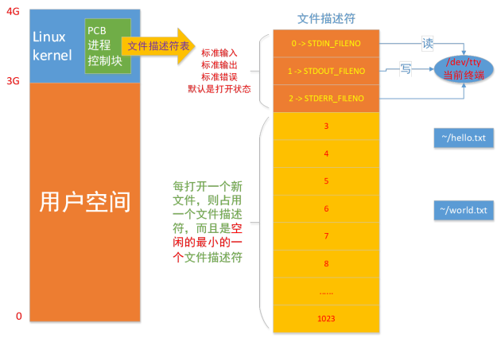
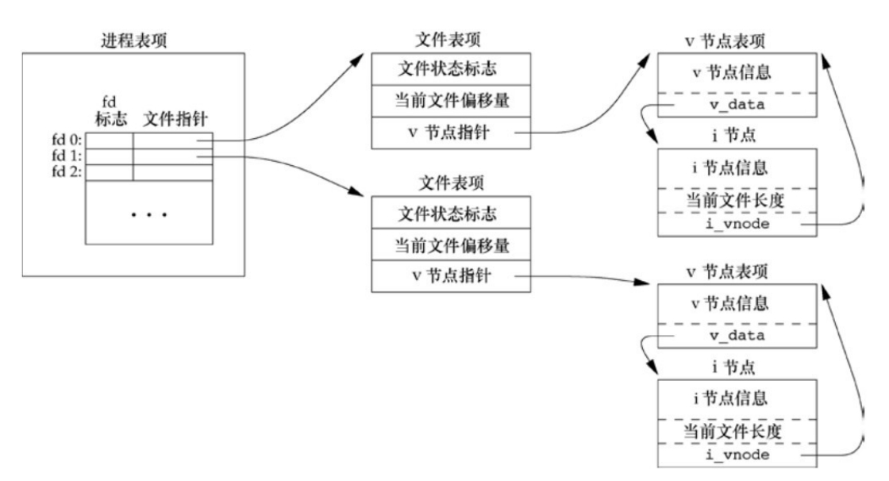
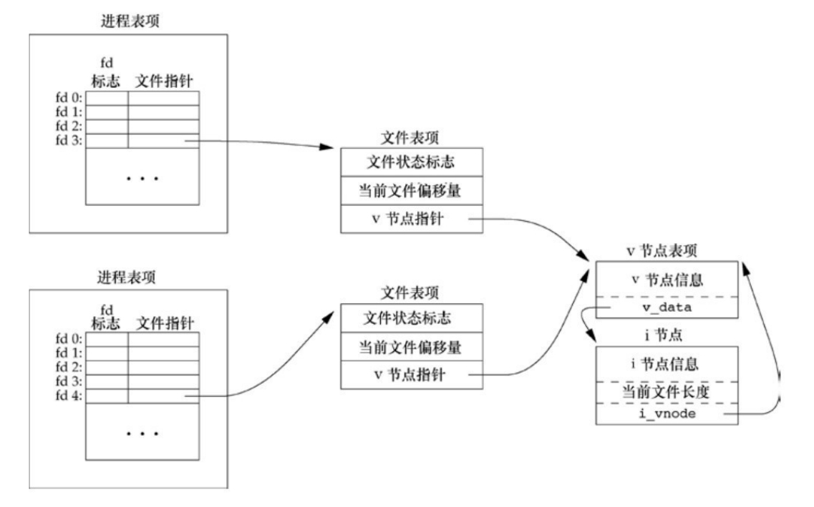
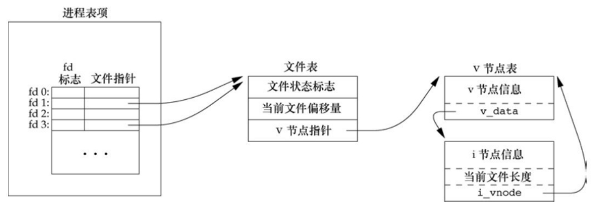

# 文件 I/O

## 文件描述符

在 Unix/Linux 操作系统中，**文件描述符（File Descriptor，简称 fd）是内核为了高效管理已被打开的 I/O 资源而提供的一个抽象指示符。它本质是一个非负整数**，当进程通过系统调用打开一个现有文件或创建一个新文件时，内核会向该进程返回一个文件描述符，作为后续所有 I/O 操作（如 `read`、`write`）的“凭证”。

秉承 Unix/Linux **“一切皆文件”** 的核心哲学，文件描述符不仅可以指向普通文件和目录，还能统一表示所有类型的已打开资源，包括管道（Pipe）、命名管道（FIFO）、网络套接字（Socket）、终端设备以及其他设备文件。

在底层实现上，操作系统的进程控制块（PCB）中维护一张 **文件描述符表**。这意味着文件描述是 **进程私有** 的，不同进程各自独立管理。当进程请求分配新的文件描述符时，内核遵循“最低可用原则”，即 **总是返回当前进程文件描述符表中未被使用的最小非负整数**。值得注意的是，每个进程在启动时，系统会默认打开三个文件描述符：0（标准输入）、1（标准输出） 和 2（标准错误），在使用的时候最好使用它们的符号常量：`STDIN_FILENO`、`STDOUT_FILENO` 以及 `STDERR_FILENO`。因此程序主动打开的第一个文件通常会分配到描述符 3。



## 常用函数

在 Unix/Linux 系统编程中，常用的文件 I/O 函数只需要这个五个：`open`、`close`、`read`、`write` 以及 `lseek`。这些函数都是不带缓冲的 I/O，每次调用都会直接触发系统调用，从用户层态切换至内核态，由内核来处理数据。

### 打开 & 关闭

```c
#include <sys/types.h>
#include <sys/stat.h>
#include <fcntl.h>

/**
 * @brief 打开 pathname 所标识的文件
 * @param pathname  文件路径名
 * @param flags     文件的打开方式
 * @param mode      新创建文件的文件权限
 * @return 成功返回可用范围内最小的文件描述符，失败返回 -1，errno 标识错误原因
 *
 */
int open(const char *pathname, int flags);
int open(const char *pathname, int flags, mode_t mode);

#include <unistd.h>

/**
 * @brief 关闭已已打开的文件描述符
 * @param fd 已打开的文件描述符
 * @return 成功关闭返回 0，关闭失败返回 -1，errno 标识错误原因
 *
 */
int close(int fd);
```

!!! note "C 语言的小细节：为什么会有两个 `open` 函数？"

    通过 man 手册查看 `open` 接口会发现有两个实现函数，但是 C 语言本身是不支持函数重载。实际上在 Linux 的 C 库中，`open` 是通过变参函数实现的，其真实原型类似 `int open(const char *pathname, int flags, ...);`。当你的 `flags` 中包含了 `O_CREAT`（即需要创建新文件）时，你必须传入第三个参数 `mode`，否则创建出的文件权限将是随机的乱码权限。

#### `flag` 参数

`flags` 参数必须包含三个访问模式之一：`O_RDONLY`、`O_WRONLY` 或 `O_RDWR`，分别表示以只读、只写或读写模式打开文件。除此之外，`flags` 可以包含零个或多个文件创建标志和文件状态标志，并进行按 **位或(`|`)** 运算。

| 标志          | 用途          |
| ------------  | -----------  |
| `O_APPEND`    | 总是文件尾部追加数据 |
| `O_ASYNC`     | 当 I/O 操作可行时，产生信号（signal）通知进程 |
| `O_CLOEXEC`   | 为新文件描述符启用 close-on-exec 标志 |
| `O_CREAT`     | 若文件不存在则创建它，使用此项，`open` 函数需同时说明第 3 个参数 `mode`，用 `mode` 指定该新文件的访问权限 |
| `O_DIRECTORY` | 如果 `pathname` 引用的不是目录，则出错 |
| `O_EXCL`      | 如果同时指定了 `O_CREAT`，而文件已经存在，则出错。用此可以测试一个文件是否存在，如果不存在，则创建此文件，这使测试和创建两者成为一个原子操作 |
| `O_LARGFILE`  | 在 32 位系统中使用此标志打开大文件 |
| `O_NOATIME`   | 调用 `read` 时，不修改文件最近访问时间 |
| `O_NOCTTY`    | 如果 `pathname` 引用的是终端设备，则不将该设备分配作为此进程的控制终端 |
| `O_NOFOLLOW`  | 如果 `pathname` 引用的是一个符号链接，则出错 |
| `O_NONBLOCK`  | 以非阻塞方式打开 |
| `O_SYNC`      | 使每次 `write` 等待物理 I/O 操作完成，包括由该 `write` 操作引起的文件属性更新所需的 I/O |
| `O_TRUNC`     | 如果此文件存在，而且为只写或读写成功打开，则将其长度截断为 0 |
| `O_TTY_INIT`  | 如果打开还未打开的终端设备，设置非标准 `termios` 参数值，使其符合 Single UNIX Specification |
| `O_DSYNC`     | 使每次 `write` 要等待物理 I/O 操作完成，但是如果该写操作并不影响读取刚写入的数据，则不需等待文件属性被更新 |
| `O_RSYNC`     | 使每一个文件描述符作为参数进行的 `read` 操作等待，直到所有对文件同一部分挂起的写操作都完成 |

在早期的 UNIX 系统版本中，无法打开一个尚未存在的文件，需要使用一个额外的函数 `creat` 创建文件，函数原型如下:

```c
#include <sys/types.h>
#include <sys/stat.h>
#include <fcntl.h>

int creat(const char *pathname, mode_t mode);
```

该函数的使用等价于现在的 `open(pathname, O_WRONLY | O_CREAT | O_TRUNC, mode);`。此函数还有一个缺点：`creat` 函数只能以只写方式打开所创建的文件，如果需要创建一个临时文件，并要求先写该文件，然后又读文件，则必须先调用 `creat`、写入数据、`close`，然后再调用 `open`、读取数据、`close`。

#### `mode` 参数

当使用 `O_CREAT` 创建新文件时，`mode` 决定了该文件的访问权限。但是文件的访问权限不是我们指定的 `mode`，而是通过 `mode & ~umask` 计算出来，这是操作系统保护系统安全的一种机制。

!!! question "一个进程最多可打开多少文件？"

    在上面说了打开一个文件会在内存中创建一个文件表项来保存文件的运行时信息，既然会占用内存资源，那肯定有一个上限。如下所示：

    ```c
    #include <fcntl.h>
    #include <stdio.h>
    #include <stdlib.h>
    #include <sys/stat.h>
    #include <sys/types.h>

    int main(int argc, char* argv[])
    {
        int count = 3;  // 从 0, 1, 2 开始，预留标准输入、输出、错误的文件描述符
        while (1)
        {
            int fd = open("/dev/null", O_RDONLY);
            if (fd < 0)
            {
                perror("open error");
                break;
            }

            count++;
        }

        printf("Max file opens is  %d\n", count);

        return 0;
    }
    ```

    输出结果

    ```bash
    open file failed: Too many open files
    Max file opens is 1024
    ```

    在不更改当前系统默认的环境情况下，一个进程最多可以打开 1024 个文件。我们可以通过 `ulimit -a` 来查看系统的所有资源使用上限，并且可以使用 `ulimit -n` 来修改可打开文件的上限。

### 读取 & 写入

```c
#include <unistd.h>

/**
 * @brief 从打开的文件中读取数据
 * @param fd    已打开的文件描述符
 * @param buf   保存读取数据的缓冲区
 * @param count 期望读取的最大字节数
 * @return 成功时返回实际读取的字节数（可能小于 count）
 *         返回 0 表示到达文件末尾（EOF）
 *         返回 -1 表示读取失败并设置 errno
 * 
 */
ssize_t read(int fd, void *buf, size_t count);

/**
 * @brief 将数据写入到已打开的文件中
 * @param fd    已打开的文件描述符
 * @param buf   包含待写入数据的缓冲区
 * @param count 期望写入的字节数
 * @return 成功时返回实际写入的字节数（可能小于 count），返回 -1 表示写入失败并设置 errno
 *  
 */
ssize_t write(int fd, const void *buf, size_t count);
```

!!! warning "避坑指南：不可忽视的“短读”与“短写”"

    这两个函数的基础使用看似很简单，但在实际工程中有一个必须妥善处理的暗坑：**`read` 和 `write` 返回的实际操作字节数可能会小于我们要求的 `count` 大小**。这种现象被称为 **“短读”或“短写”**。

    产生“短读/短写”的常见原因包括：

    - 遇到文件结束符（EOF）：例如要求读 100 字节，但文件只剩 30 字节就到末尾了，此时会返回 30。
    - 操作网络套接字（Socket）和管道（Pipe）：底层的网络缓冲区可能暂时没有足够的数据，或接收端的缓冲区已满，内核会先返回目前能处理的部分。
    - 被信号中断（`EINTR`）：在执行耗时的 I/O 操作时，进程可能会收到系统的信号（Signal）。如果信号处理函数返回后，I/O 调用被中断，会返回 -1 并将错误码 `ernro` 设置为 `EINTR`。这不是真正的错误，而是系统在提醒你“刚刚被打断了，请重试”。

为了确保数据能够被完整、可靠地读取与写入，在实际工程（尤其是网络编程与进程间通信）中，我们通常不会直接调用原生的 `read`/`write`，而是会自己封装一个循环逻辑，处理好指针偏移和被信号打断的情况。下面是较为经典的 `readn` 和 `writen` 函数实现模板：

```c
#include <unistd.h>
#include <errno.h>

/**
 * @brief 确保读取到指定大小的数据，直到读满或遇到 EOF / 致命错误
 * @param fd    文件描述符
 * @param buf   目标缓冲区
 * @param count 需要读取的字节数
 * @return 实际读取的字节数，可能小于 count（EOF）或 -1（错误）
 *
 */
ssize_t readn(int fd, void* buf, size_t count)
{
    if (fd < 0)
    {
        return -1;  // 文件描述符错误值预防判断
    }

    ssize_t nleft = count;   // 剩余需要读取的字节数
    ssize_t nread = 0;       // 每次实际读取的字节数
    char* ptr = (char*)buf;  //  使用 char* 指针以便于进行指针偏移计算

    while (nleft > 0)
    {
        nread = read(fd, ptr, nleft);
        if (nread < 0)
        {
            if (errno == EINTR)
            {
                nread = 0;  // 被信号中断，这不算错误，重新调用 read
            }
            else
            {
                return -1;  // 发生真正的错误，直接返回
            }
        }
        else if (nread == 0)
        {
            break;  // 读到了文件末尾 EOF，直接跳出循环
        }

        nleft -= nread;  // 更新剩余字节数
        ptr += nread;    // 缓冲区指针向后偏移，准备下一次接收
    }

    return count - nleft;
}

/**
 * @brief 确保将指定大小的数据全部写入，直到写完或遇到致命错误
 * @param fd    文件描述符
 * @param buf   源缓冲区
 * @param count 需要写入的字节数
 * @return 实际写入的字节数 count
 *
 */
ssize_t readn(int fd, const void* buf, size_t count)
{
    if (fd < 0)
    {
        return -1;  // 文件描述符错误值预防判断
    }

    ssize_t nleft = count;  // 剩余需要写入的字节数
    ssize_t nwrite = 0;     // 每次实际写入的字节数
    const char* ptr = (const char*)buf;

    while (nleft > 0)
    {
        nwrite = write(fd, ptr, nleft);
        if (nwrite <= 0)
        {
            if (nwrite < 0 && errno == EINTR)
            {
                nwrite = 0;  // 被信号中断，重新调用 write
            }
            else
            {
                return -1;  // 发生真正的错误
            }
        }

        nleft -= nwrite;
        ptr += nwrite;
    }

    return count;
}
```

!!! quote "指针强制转换的巧思"

    因为 C 语言中 `void *` 类型的指针是不能进行加减运算的（编译器不知道该类型的大小），所以必须强转为按 1 字节寻址的 `char *`，才能实现 `ptr += nread`。

掌握了 `read` 和 `write` 的使用方式，思考一个问题：阻塞现象是 `read` 的属性，还是文件的属性？

在实际测试中，我们可能会发现：用 `read` 去读一个磁盘上的 `.txt` 文件时，瞬间就返回了；但用 `read` 去读键盘输入（终端）或者网络数据时，程序却卡在那里不动了（阻塞）。那么，阻塞到底是 `read` 函数本身的特性，还是文件的特性 —— 结论当然是：阻塞是文件（文件描述符 `fd`）的属性，而不是 `read` 函数的属性。`read` 只是按照文件描述符的设定行事。在 Linux (参考 APUE 经典理论) 中，文件被隐式地分为两大类：

- 普通文件（Regular Files）：对磁盘普通文件的 `read` 操作永远不会被视为阻塞。哪怕读取需要花费几十毫秒等待磁盘转动，内核也会保证在合理的时间内返回结果。如果文件读到了尽头，`read` 会直接返回 0（EOF），绝不会卡住等新数据写入。
- 慢速文件（Slow Files）：包括终端设备（如键盘）、管道（Pipe）、FIFO 和 网络套接字（Socket），这些设备的特点是“数据何时到来是未知的”。当你对一个没有任何数据的慢速文件调用 `read` 时，默认情况下，内核会把当前进程挂起（投入睡眠），直到有数据到来才唤醒它，这就是我们常说的“阻塞”。

即使是默认会阻塞的“慢速文件”，我们也可以通过改变文件描述符的属性来让它变得不阻塞。如果在 `open` 这个文件时，或者中途使用 `fcntl` 函数，给这个文件描述符加上了 `O_NONBLOCK`（非阻塞） 标志，那么 `read` 的行为就会发生不可思议的变化：当管道或网络中没有数据时，`read` 不会再让进程睡眠等待，而是会立刻返回 -1，并将 `errno` 设置为 `EAGAIN` 或 `EWOULDBLOCK`（意思是：现在没数据，请稍后再试）。

### 修改文件偏移量

对于每个打开的文件，系统内核都会记录其文件偏移量，文件偏移量是指下一个 `read` 和 `write` 操作的文件起始位置，会以相对于文件头部起始点的文件当前位置来表示。文件打开时，会将文件偏移量设置为指向文件开始，以后的每次 `read` 和 `write` 调用将自动对其进行调整，以指向已读或已写数据后的下一个字节。

```c
#include <sys/types.h>
#include <unistd.h>

/**
  * @brief 根据指令 whence 将已打开文件描述 fd 的文件偏移量重新定位到参数 offset 
  * @param fd     已打开的文件描述符
  * @param offset 相对起始位置的偏移量（单位：字节）
  * @param whence 指定的起始位置
  * @return 成功返回偏移后的位置与起始位置的距离，失败返回 -1
  *
  */
off_t lseek(int fd, off_t offset, int whence);
```

`whence` 表示参照哪个基点来设置偏移量，应为下面三个之一：

- `SEEK_SET`: 将文件的偏移量设置为距文件开始处 `offset` 个字节
- `SEEK_SET`: 将文件的偏移量设置为其当前值加 `offset`，`offset` 可正可负
- `SEEK_END`: 将文件的偏移量设置为距文件长度加 `offset`，`offset` 可正可负

通常，文件的当前偏移量应当是一个非负整数，但是，某些设备也可能允许负的偏移量。但对于普通文件，其偏移量必须是非负值。因为偏移量可能是负值，所以在比较 `lseek` 的返回值时应当谨慎，不要测试它是否小于 0，而要测试它是否等于 −1。`lseek` 不适用与所有类型的文件，不允将 `lseek` 应用于管道、FIFO、Socket 或者终端。一旦如此，就会返回 -1，并将 `errno` 置为 `ESPIPE`。

`lseek` 调用只是调整内核中与文件描述符相关的文件偏移量记录，并没有引起任何物理设备的访问。然后，该偏移量用于下一个读或写操作。

文件偏移量可以大于文件的当前长度，在这个情况下，对该文件的下一次写将加长该文件并在文件中构成一个空洞，这一点是允许的。位于文件中但没有写过的字节都被读为 0（空字节）。文件中的空洞并不要求在磁盘上占用实际存储区。具体处理方式与文件系统的实现有关，当定位到超出文件尾端之后写时，对于新写的数据需要分配磁盘块，但是对于原文件尾端和新开始写位置之间的部分则不需要分配磁盘块。尽管可以实现 64 位文件偏移量，但是能否创建一个大于 2GB($2^{31} - 1$) 的文件则依赖于底层文件系统的类型。

```c
#include <fcntl.h>
#include <stdio.h>
#include <stdlib.h>
#include <sys/stat.h>
#include <sys/types.h>
#include <unistd.h>

#define FILE_SIZE (1024L * 1024L * 8)

int main(int argc, char* argv[])
{
    int fd = open(argv[1], O_RDWR | O_CREAT, 0644);
    if (fd < 0)
    {
        perror("open failed");
        return EXIT_FAILURE;
    }

    if (lseek(fd, FILE_SIZE - 1, SEEK_SET) < 0)
    {
        perror("lseek failed");
        close(fd);
        return EXIT_FAILURE;
    }

    write(fd, "", 1);
    close(fd);

    return 0;
}
```

上面的程序创建了一个空洞文件，文件从第 0 字节到第 8388606 字节从未被写入，文件系统不会为这段空洞分配实际的数据块，读取这段区域时内核会直接返回全零。在第 8388607 字节处写入 1 字节，所以文件的逻辑大小是 8MB。

用 `ls -lh` 和 `du -sh` 可以直观看到差异：

```bash
ls -lh hole-file # 逻辑大小
-rw-r--r-- 1 jeffery jeffery 8.0M  5月 25 00:02 hole-file

du -sh hole-file  # 实际占用磁盘块
4.0K    hole-file # 只有末尾那 1 字节所在的一个块
```

### 使用示例

#### 实现类似 `cp` 命令的程序

```c
#include <errno.h>
#include <fcntl.h>
#include <stdio.h>
#include <stdlib.h>
#include <string.h>
#include <sys/stat.h>
#include <sys/types.h>
#include <unistd.h>

#define BUFFER_SIZE 1024

/**
 * @brief 确保读取到指定大小的数据，直到读满或遇到 EOF / 致命错误
 * @param fd    文件描述符
 * @param buf   目标缓冲区
 * @param count 需要读取的字节数
 * @return 实际读取的字节数，可能小于 count（EOF）或 -1（错误）
 *
 */
ssize_t readn(int fd, void* buf, size_t count);

/**
 * @brief 确保将指定大小的数据全部写入，直到写完或遇到致命错误
 * @param fd    文件描述符
 * @param buf   源缓冲区
 * @param count 需要写入的字节数
 * @return 实际写入的字节数 count
 *
 */
ssize_t writen(int fd, const void* buf, size_t count);

int main(int argc, char* argv[])
{
    if (argc < 3)
    {
        fprintf(stderr, "Usage: %s <source> <destination>\n", argv[0]);
        return EXIT_FAILURE;
    }

    int sfd = open(argv[1], O_RDONLY);
    if (sfd < 0)
    {
        perror("open source");
        return EXIT_FAILURE;
    }

    int dfd = open(argv[2], O_WRONLY | O_CREAT | O_TRUNC, 0644);
    if (dfd < 0)
    {
        perror("open destination");
        close(sfd);
        return EXIT_FAILURE;
    }

    char buffer[BUFFER_SIZE];
    printf("Copying from %s to %s...\n", argv[1], argv[2]);

    ssize_t rlen = 0;
    while ((rlen = readn(sfd, buffer, BUFFER_SIZE)) > 0)
    {
        if (writen(dfd, buffer, rlen) != rlen)
        {
            perror("write error");
            close(sfd);
            close(dfd);
            return EXIT_FAILURE;
        }
    }

    if (rlen < 0)
    {
        perror("read error");
        close(sfd);
        close(dfd);
        return EXIT_FAILURE;
    }

    printf("Copy completed.\n");

    close(dfd);
    close(sfd);
    return 0;
}

ssize_t readn(int fd, void* buf, size_t count)
{
    if (fd < 0)
    {
        return -1;  // 文件描述符错误值预防判断
    }

    ssize_t nleft = count;   // 剩余需要读取的字节数
    ssize_t nread = 0;       // 每次实际读取的字节数
    char* ptr = (char*)buf;  //  使用 char* 指针以便于进行指针偏移计算

    while (nleft > 0)
    {
        nread = read(fd, ptr, nleft);
        if (nread < 0)
        {
            if (errno == EINTR)
            {
                nread = 0;  // 被信号中断，这不算错误，重新调用 read
            }
            else
            {
                return -1;  // 发生真正的错误，直接返回
            }
        }
        else if (nread == 0)
        {
            break;  // 读到了文件末尾 EOF，直接跳出循环
        }

        nleft -= nread;  // 更新剩余字节数
        ptr += nread;    // 缓冲区指针向后偏移，准备下一次接收
    }

    return count - nleft;
}

ssize_t writen(int fd, const void* buf, size_t count)
{
    if (fd < 0)
    {
        return -1;  // 文件描述符错误值预防判断
    }

    ssize_t nleft = count;  // 剩余需要写入的字节数
    ssize_t nwrite = 0;     // 每次实际写入的字节数
    const char* ptr = (const char*)buf;

    while (nleft > 0)
    {
        nwrite = write(fd, ptr, nleft);
        if (nwrite <= 0)
        {
            if (nwrite < 0 && errno == EINTR)
            {
                nwrite = 0;  // 被信号中断，重新调用 write
            }
            else
            {
                return -1;  // 发生真正的错误
            }
        }

        nleft -= nwrite;
        ptr += nwrite;
    }

    return count;
}
```

#### 获取文件大小

```c
#include <fcntl.h>
#include <stdio.h>
#include <stdlib.h>
#include <string.h>
#include <sys/stat.h>
#include <sys/types.h>
#include <unistd.h>

int main(int argc, char* argv[])
{
    if (argc != 2)
    {
        fprintf(stderr, "Usage: %s <filename>\n", argv[0]);
        return EXIT_FAILURE;
    }

    int fd = open(argv[1], O_RDONLY);
    if (fd < 0)
    {
        perror("open error");
        return EXIT_FAILURE;
    }

    off_t filesize = lseek(fd, 0, SEEK_END);
    if (filesize < 0)
    {
        perror("lseek error");
        close(fd);
        return EXIT_FAILURE;
    }

    printf("File size: %ld bytes\n", filesize);
    close(fd);

    return 0;
}
```

### 实现类似 `tee` 命令的程序

```c
#include <errno.h>
#include <fcntl.h>
#include <stdio.h>
#include <stdlib.h>
#include <string.h>
#include <sys/stat.h>
#include <sys/types.h>
#include <unistd.h>

#define BUFFER_SIZE 1024

ssize_t writen(int fd, const void* buf, size_t count);

int main(int argc, char* argv[])
{
    // 先把所有输出文件打开，确保在读取标准输入之前就能成功打开所有目标文件
    int fds[argc - 1];
    for (int i = 1; i < argc; i++)
    {
        fds[i - 1] = open(argv[i], O_WRONLY | O_CREAT | O_TRUNC, 0644);
        if (fds[i - 1] < 0)
        {
            fprintf(stderr, "open %s failed: %s\n", argv[i], strerror(errno));
            return EXIT_FAILURE;
        }
    }

    char buf[BUFFER_SIZE] = {0};
    int rlen = 0;
    // 从标准输入读取数据
    while ((rlen = read(STDIN_FILENO, buf, BUFFER_SIZE)) > 0)
    {
        // 先写到标准输出
        if (writen(STDOUT_FILENO, buf, rlen) != rlen)
        {
            perror("write error");
            return EXIT_FAILURE;
        }

        // 写到每个目标文件
        for (int i = 0; i < argc - 1; i++)
        {
            if (writen(fds[i], buf, rlen) != rlen)
            {
                perror("write error");
                return EXIT_FAILURE;
            }
        }
    }

    if (rlen < 0)
    {
        perror("read error");
        return EXIT_FAILURE;
    }

    // 写完关闭所有主动打开的文件描述符
    for (int i = 0; i < argc - 1; i++)
    {
        close(fds[i]);
    }

    return 0;
}

ssize_t writen(int fd, const void* buf, size_t count)
{
    if (fd < 0)
    {
        errno = EINVAL;
        return -1;
    }

    ssize_t nleft = count;
    ssize_t nwrite = 0;
    const char* ptr = (const char*)buf;

    while (nleft > 0)
    {
        nwrite = write(fd, ptr, nleft);
        if (nwrite <= 0)
        {
            if (nwrite < 0 && errno == EINTR)
            {
                nwrite = 0;
            }
            else
            {
                return -1;
            }
        }

        nleft -= nwrite;
        ptr += nwrite;
    }

    return count;
}
```

## 文件共享

UNIX/Linux 系统支持文件在不同的进程间共享打开文件，共享文件本质上是研究内核如何管理已打开的文件。内核使用三种数据结构表示打开文件，他们之间的关系决定了在文件共享方面一个进程对另一个进程可能产生的影响。

三种数据结构是什么： 

1. 进程级：文件描述符表 (File Descriptor Table)
    - 每个进程在进程控制块中都有一个记录项，记录项中包含一张打开的文件描述符表
    - 表中的每一项包含：文件描述符标志和一个指向系统级打开文件表达的指针
2. 系统级：打开文件表 (Open File Table)
    - 内核为所有打开的文件维护的一张全局表，表中的每一项称为“文件表项”
    - 每个文件表项包含：文件状态标志（`O_RDONLY`, `O_APPEND` 等）、当前的读写偏移量（即光标位置 `offset`）以及指向 Inode 表的指针
3. 文件系统级：索引节点表（Inode Table）
    - 每个实际存在于磁盘的文件，在内存中都有唯一的一个 Inode 节点
    - 它保存了文件的固有属性：文件大小、所有者权限以及数据在磁盘上的物理位置

下面是一个进程对应的三种数据结构之间的关系，该进程有两个不同的打开文件：一个文件从标准输入打开，另一个从标准输出打开。



如果是在两个不同的进程中打开，也可以打开同一个文件，如下所示



可能会有多个文件描述符指向同一个文件表项，比如 `dup` 函数，就能看到这一点。在 `fork` 之后也会发生相同的情况，此时父进程、子进程各自的每一个打开文件描述符共享同一个文件表项。对于多个进程读取同一文件都能正确工作，是因为每个进程都有它自己的文件表项，其中也有它自己的当前文件偏移量。但是，当多个进程写同一文件时，则可能产生预想不到的结果。为了说明如何避免这种情况，需要理解原子操作。

!!! question "当其中一个 `fd` 被 `close` 时，能否立即释放它对应的文件表项"

    答案是不能，否则其他仍然指向该表项的 `fd` 会因此变成悬空引用。

    内核通过引用计数来解决这个问题。`struct file` 内部维护一个计数器 `f_count`，每当有新的 `fd` 指向该表项时计数加 1，`close` 时计数减 1，只有当计数归零时才真正释放该文件表项的内存。

    因此，**`fork` 后若子进程不再需要从父进程继承的某些 `fd`，应当显式调用 `close` 关闭**，否则即使父进程已经关闭，文件表项的引用计数仍不为零，相关资源不会被释放，可能导致资源泄漏或管道写端无法关闭等问题。

## 原子操作

当我们需要将数据追加到文件末，程序可能会实现成下面的形式：

```c
if (lseek(fd, 0, SEEK_END) == -1) {
    perror("lseek error");
    return EXIT_FAILURE;
}

if (wirte(fd, buf, rlen) <= 0) {
    perror("write error");
    return EXIT_FAILURE;
}
```

对单个进程而言，这段程序能正常工作，但若有多个进程同时使用这个方法将数据追加写到同一文件，则会产生问题。假设两个独立的进程 A 和 B 都对同一个文件进行追加写操作。每个进程都已打开了该文件，但未使用 `O_APPEND` 标志。每个进程都有它自己的文件表项，但共享一个 inode 节点表项。假定进程 A 调用了 `lseek`，它将自己的文件表项的偏移量设置为 1500 字节处（文件末尾）。然后内核切换进程，进程 B 开始调用 `lseek`，也将文件表项的偏移量设置为 1500 字节处（文件末尾）。然后进程 B 调用 `write` 写入数据，将文件偏移量增加至 1600。因为文件的长度增加了，inode 节点表项当前文件长度也更新为 1600。然后内核又切换至进程 A，使用进程 A 恢复运行。当进程 A 调用 `write` 写入数据时，还是从当前文件偏移量（1500）处开始写入数据，这样就覆盖了进程 B 刚刚写入的数据。

解决这种办法就是使这两个操作称为一个原子操作，原子操作是一个不可分割的操作，通过原子操作可以解决多线程/进程之间的竞争和冲突问题。一般而言，原子操作（atomic operation）指的是由多步组成的一个操作。如果该操作原子地执行，要么执行完所有步骤，要么就一步也不执行，不可能只执行所有步骤的一个子集。
 
在实际工程中，对 `open` 函数设置 `O_CREAT` 和 `O_EXCL` 标志也可以原子判断当前文件是否存在，不存在并创建文件。

## 复制文件描述符

复制文件描述符后，新旧两个文件描述符会指向内核中的 **同一个打开文件表项**。这意味着它们 **共享同一个文件偏移量（光标）和文件状态标志**。因此，通过其中一个文件描述符进行读写引起的光标移动，会直接作用于另一个文件描述符，如下图所示：



```c
#include <unistd.h>

/**
 * @brief 创建一个文件描述符 oldfd 的副本
 * @param oldfd 已打开文件描述符
 * @return 成功返回新的最小可用文件描述符，失败返回 -1，并相应设置 errno
 *  
 */
int dup(int oldfd);

/**
 * @brief 将 oldfd 复制到指定的 newfd
 * @param oldfd 已打开文件描述符
 * @param newfd 指定的文件描述符编号
 * @return 成功返回指定的 newfd，失败返回 -1 并设置 errno
 *  
 */
int dup2(int oldfd, int newfd);
```

由 `dup` 返回的新文件描述符一定是当前可用文件描述符中的最小数值。`dup2()` 系统调用执行的任务与 `dup()` 相同，但它不使用编号最小的未使用文件描述符，而是使用 `newfd` 中指定的文件描述符编号。如果文件描述符 `newfd` 之前已打开，则在重新使用之前会默默关闭它，关闭和重用 `newfd` 是原子操作。如果旧的文件描述符是一个无效的，则函数调用会失败，并且不会关闭 `newfd`；如果旧的文件描述符是有效的，并且 `oldfd` 与 `newfd` 相同，则不会做任何事，直接返回 `newfd`。

!!! example "保持 `puts` 下的内容不变，将 `puts` 的内容输出到文件中"

    **使用 `open` 实现**: 缺点是非原子操作，如果在 `close` 和 `open` 之间，有另一个线程打开了文件抢占了 1，重定向就会失败

    ```c
    #include <fcntl.h>
    #include <stdio.h>
    #include <stdlib.h>
    #include <sys/stat.h>
    #include <sys/types.h>
    #include <unistd.h>

    int main(int argc, char* argv[])
    {
        if (argc != 2)
        {
            fprintf(stderr, "Usage: %s <filename>\n", argv[0]);
            return EXIT_FAILURE;
        }

        close(STDOUT_FILENO); // 首先关闭标准输出的文件描述符
        // 打开一个文件，此时的文件描述符表中最小的可用就是 1
        int fd = open(argv[1], O_CREAT | O_WRONLY | O_TRUNC, 0666);
        if (fd < 0)
        {
            perror("open() error");
            return EXIT_FAILURE;
        }

        // 保持下面的内容不动，将下面的内容输出的到文件中
        puts("Hello World!");

        close(fd);

        return 0;
    }
    ```

    **使用 `dup` 实现**：缺点是非原子操作，`close` 和 `dup` 之间存在被抢占的风险

    ```c
    #include <fcntl.h>
    #include <stdio.h>
    #include <stdlib.h>
    #include <sys/stat.h>
    #include <sys/types.h>
    #include <unistd.h>

    int main(int argc, char* argv[])
    {
        if (argc != 2)
        {
            fprintf(stderr, "Usage: %s <filename>\n", argv[0]);
            return EXIT_FAILURE;
        }

        int fd = open(argv[1], O_WRONLY | O_CREAT | O_TRUNC, 0644);
        if (fd < 0)
        {
            perror("open error");
            return EXIT_FAILURE;
        }

        // 关闭标准输出
        if (STDOUT_FILENO != fd)
        {
            close(STDOUT_FILENO);
            dup(fd);  // 复制 fd，产生一个占用 1 的文件描述符
            close(fd);
        }

        // 保持下面的内容不动，将下面的内容输出的到文件中
        puts("Hello World!");

        return 0;
    }
    ```

    **使用 `dup2` 实现**：

    ```c
    #include <fcntl.h>
    #include <stdio.h>
    #include <stdlib.h>
    #include <sys/stat.h>
    #include <sys/types.h>
    #include <unistd.h>

    int main(int argc, char* argv[])
    {
        if (argc != 2)
        {
            fprintf(stderr, "Usage: %s <filename>\n", argv[0]);
            return EXIT_FAILURE;
        }

        int fd = open(argv[1], O_WRONLY | O_CREAT | O_TRUNC, 0644);
        if (fd < 0)
        {
            perror("open error");
            return EXIT_FAILURE;
        }

        dup2(fd, STDOUT_FILENO);
        close(fd);

        puts("Hello World!");

        return 0;
    }
    ```

## 文件控制操作： `fcntl`

`fcntl` 被称为 Linux 文件操作的“瑞士军刀”。它可用对一个已经打开的文件描述符执行各种各样的控制操作，比如改变文件的属性、设置非阻塞、获取文件锁等。

```c
#include <unistd.h>
#include <fcntl.h>

/**
 * @brief 对一个打开的文件描述符执行一系列控制操作
 * @param fd    已打开的文件描述符
 * @param cmd   控制操作指令
 * @param ...   根据 cmd 的不同，可能需要传递第三个可选参数（通常是 int arg）
 *  @return 成功时的返回值视 cmd 而定，失败统一返回 -1 并设置 errno
 * 
 */
int fcntl(int fd, int cmd, ... /* arg */ );
```

**`fcntl` 函数主要提供以下 5 种功能**: 

- 复制一个已有的描述符（cmd = `F_DUPFD` 或 `F_DUPFD_CLOEXEC`）
- 获取/设置文件描述符标志（cmd = `F_GETFD` 或 `F_SETFD`）
- 获取/设置文件状态标志（`cmd=F_GETFL` 或 `F_SETFL`）
- 获取/设置异步 I/O 所有权（cmd = `F_GETOWN` 或 `F_SETOWN`）
- 获取/设置记录锁（cmd = `F_GETLK、F_SETLK` 或 `F_SETLKW`）

!!! warning "文件描述符标志 vs 文件状态标志"

    - **文件描述符标志（FD）**：是进程级别的，比如 `FD_CLOEXEC`，它只作用于当前进程的这个 `fd`。
    - **文件状态标志（FL）**：是系统级别的（打开文件表项），比如 `O_RDWR`、`O_APPEND`、`O_NONBLOCK`。如果通过 `dup` 复制了 `fd`，或者 `fork` 了子进程，修改这个标志会影响所有指向该文件的 `fd`。

详细控制指令参考下表：

| **相关标志（`cmd`）** | **具体描述** |
| ------------------- | ----------- |
| `F_DUPFD`           | 复制文件描述符 fd，新描述符作为函数返回值。它是尚未打开的描述符中，大于或等于第三个参数 `arg` 的最小值。新描述符与原 `fd` 共享同一个“文件表项”，但拥有自己的“文件描述符标志”（其 `FD_CLOEXEC` 会被清除） |
| `F_DUPFD_CLOEXEC`   | 似于 `F_DUPFD`，但在复制的同时，原子性地设置新描述符的 `FD_CLOEXEC` 标志 |
| `F_GETFD`           | 返回对应 `fd` 的文件描述符标志，目前只定义了一个文件描述符标志 `FD_CLOEXEC` |
| `F_SETFD`           | 设置文件描述符标志，新标志值由第三个参数 `arg` 决定 |
| `F_GETFL`           | 返回对应 `fd` 的文件状态标志（如只读、可写、追加等） |
| `F_SETFL`           | 设置文件状态标志，新标志值由第三个参数 `arg` 决定。注：仅能更改 `O_APPEND`、`O_NONBLOCK`、`O_SYNC`、`O_ASYNC` 等标志，无法更改文件的读写权限（如 `O_RDONLY` 等在 `open` 时就已定死） |
| `F_GETOWN`          | 获取当前接收 `SIGIO` 和 `SIGURG` 信号的进程 ID 或进程组 ID |
| `F_SETOWN`          | 设置接收 `SIGIO` 和 `SIGURG` 信号的进程 ID 或进程组 ID。正的 `arg` 指定一个进程 ID，负的 `arg` 表示等于 `arg` 绝对值的一个进程组 ID |

`fcntl` 最经典的应用场景是在 **网络编程 / 高并发服务器（如 `epoll`）** 中，将一个 Socket 文件描述符设置为非阻塞模式。这意味着当网络中没有数据时，`read` 操作不会让进程睡眠卡死，而是立刻返回 -1 并抛出 `EAGAIN` 错误。

在更改文件状态标志时，我们必须严格遵循 “读 -> 改 -> 写 (Read-Modify-Write)” 的模式。

```c
#include <fcntl.h>
#include <stdio.h>

/**
 * @brief 将指定的文件描述符设置为非阻塞模式
 * @param fd 需要操作的文件描述符
 * @return 成功返回旧的状态标志（以便日后恢复），失败返回 -1
 * 
 */
int set_nonblocking(int fd) {
    // 获取文件描述符当前的状态标志 (Flags)
    int old_flags = fcntl(fd, F_GETFL);  
    if (old_flags == -1) {
        perror("fcntl F_GETFL error");
        return -1;
    }
    
    // 在原标志的基础上，按位或 (|) 加上非阻塞标志
    int new_flags = old_flags | O_NONBLOCK; 
    
    // 写将新的状态标志设置回去
    if (fcntl(fd, F_SETFL, new_flags) == -1) {
        perror("fcntl F_SETFL error");
        return -1;
    }
    
    // 返回旧的标志，方便调用者在需要时恢复原状
    return old_flags;  
}
```

!!! tip "为什么不能直接 `fcntl(fd, F_SETFL, O_NONBLOCK)`？"

    因为 `F_SETFL` 操作是完全覆盖，如果这个文件最初是以追加模式（`O_APPEND`）打开的，我们直接执行 `fcntl(fd, F_SETFL, O_NONBLOCK)`，非阻塞特性确实加上了，但原来的 `O_APPEND` 属性就会被无情地情况抹除。因此，正确的做法永远是先 `GET` 拿到当前属性，使用按位或 `|` 加上新属性，然后再 `SET` 回去。
